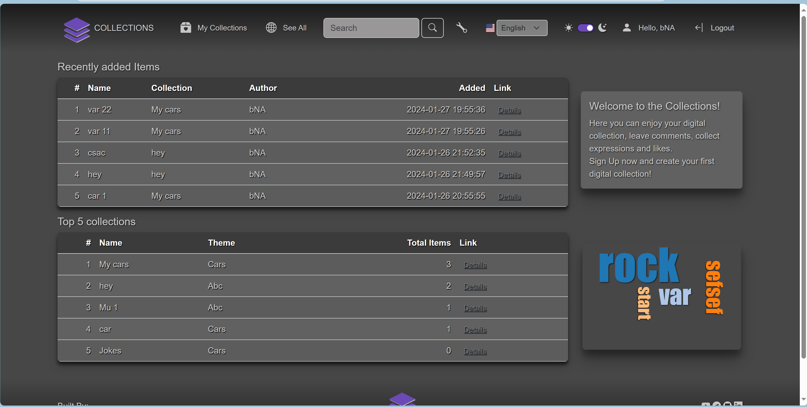
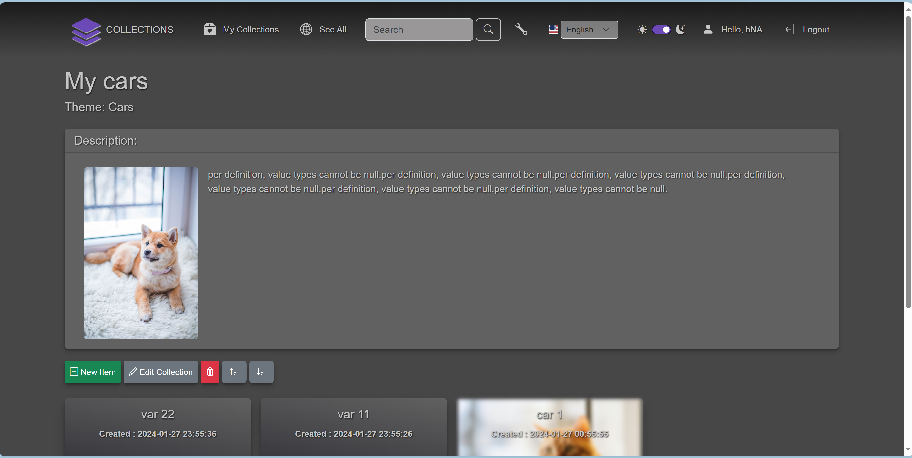
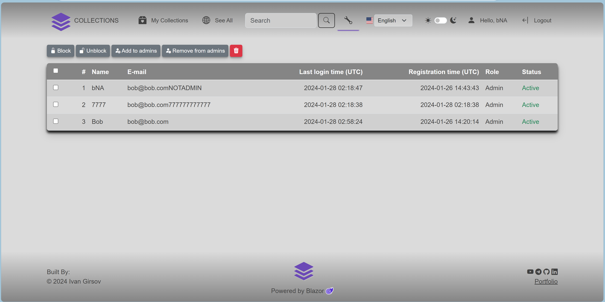
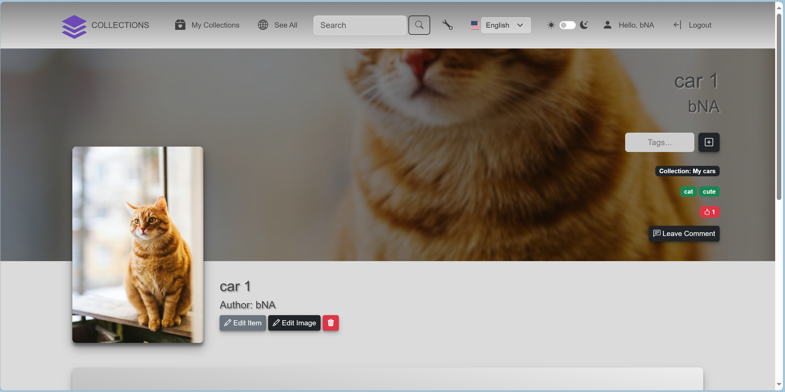

# CollectionsWebApp

    

The Collections Web App designed to automate collection management.\
Users can create collections of items of their choice, supply them\
with additional tags and information. All collections are available for anyone\
on the internet with no registration.
After registration users can create\
collections, leave comments and likes.

Also the app implements admin page for user management. This page available only for the web site admins.

You can check out a test version <a href="https://task-test-react.azurewebsites.net/">*here*</a>

---

  
<i>UI Screenshots</i>

---
